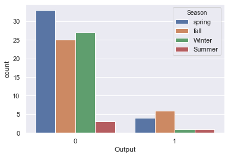
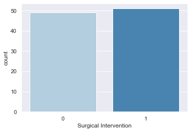
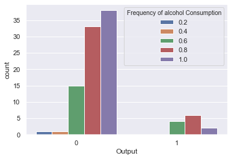
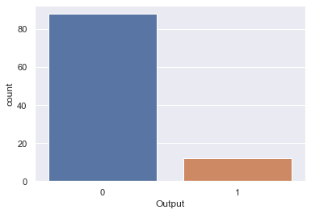

# Fertility Overview
* Infertility Rate is at an all time low in the U.S. and I want to classify if features will affect infertility rate.
* 100 sample from UCI Machine Learning Dataset
* 93% percision with Logisctic Regression and Random Forest Regressor

# Exploratory Data Analysis

# Model Building
The training and testing data set for this data is 70% training and 30% testing

I decided to use a logistic Regression and Random Forest for this project:
* Logistic Regression: baseline for the model
* Random Forest: with the features provided, I thought it would improve our model

# Model Performance
The performance used is a confusion matrix and classification report.
Both Logistic and Random Forest gave the same result.

Confusion Matrix:

* [[28  0]
* [ 2  0]]
             
             
             precision    recall  f1-score   support

           0       0.93      1.00      0.97        28
           1       0.00      0.00      0.00         2
